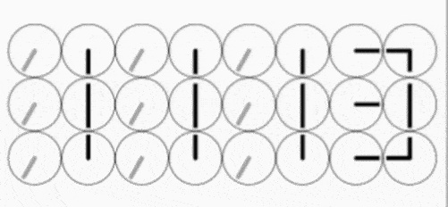
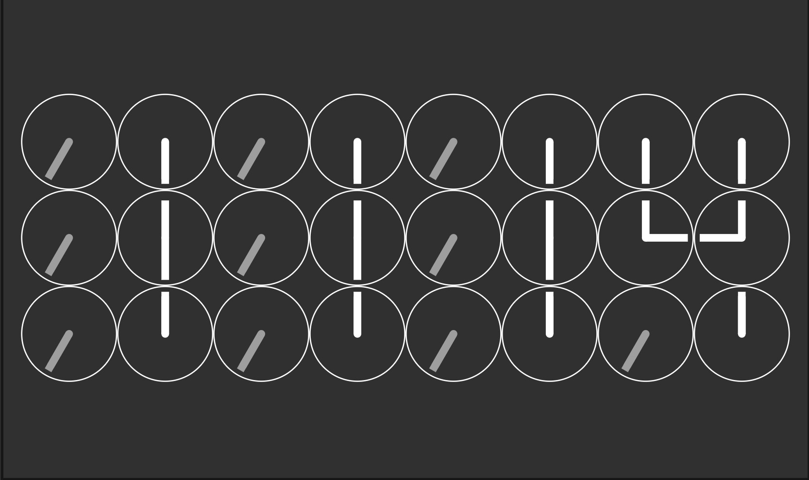
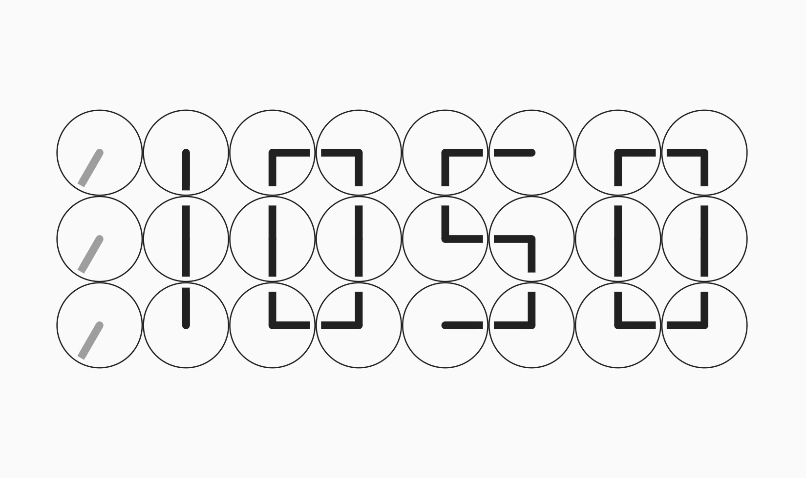

# My submission for the Flutter Clock challenge

My clock is located in the folder [clock_clock](/clock_clock).

## Start the project

Open this folder in Visual Code, in the terminal run the commands

    cd clock_clock
    flutter run

Work is still in progress but this repo is now public.

*Fill free to give me some feedback.*

Design more than inspired from [humanssince1982](https://www.humanssince1982.com/the-clock-clock-white).

